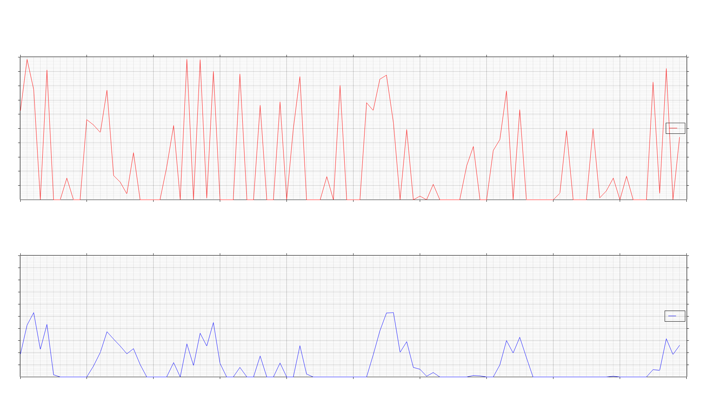

# Low pass Filter

> This is a demonstration of a low pas filter in Rust

This is purely done for my understanding and is not intended to be 
used in production.

## Citations

[Blog](https://kiritchatterjee.wordpress.com/2014/11/10/a-simple-digital-low-pass-filter-in-c/)
